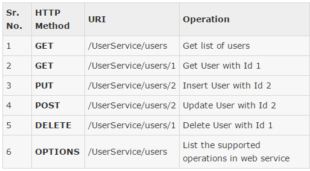

  
#Restful web services with JAX-RS
##Day 1: 
###Studymaterial:
[Tutorials point on ReST](https://www.tutorialspoint.com/restful/index.htm) 
**Read the 10 points under headline: RESTful Tutorial** (You can skip 3 and 4 about env and first application)  
[Tutorial on how to manually test rest api with postman app](https://blog.matrix42.com/2016/08/08/api-testing-postman-part-1/) 
[Nice list of simple examples using Jax-RS](http://www.mkyong.com/tutorials/jax-rs-tutorials/)


###Definition of web service
"*a method of communication between two electronic devices over a network. 
It is a software function provided at a network address over the web, with the service always on.*"


###Restful webservice
- HTTP transport protocol
- No specific Data Protocol


###Alternatives to Restful webservices
- SOAP
	- Simple Object Access Protocol
	- [Read more here](https://en.wikipedia.org/wiki/SOAP)
- WSDL
	- Web Service Description Language
	- [Read more here](http://www.w3schools.com/xml/xml_wsdl.asp)


###REST - REpresentational State Transfer 
- Representational
    - Clients possess the information necessary to identify, modify, and/or delete a web resource.
- State
    - All resource state information is stored on the client.
- Transfer
    - Client state is passed from the client to the service through HTTP.


### Demo
  
- Start new maven project
- import the relevant dependencies to POM.xml
	- [Here is an example](https://dzone.com/articles/build-rest-service-netbeans-7)
- Create a 'New Restful webservice from pattern'
- Change the path to: api/myresponse
- Change the @Get method to just send a hello world message.
- Test it from the browser.
- Test it from Postman


###Postman
- Install
- Introduction to the tool


###Rest and HTTP methods
- GET - Provides a read only access to a resource.
- PUT - Used to create a new resource.
- DELETE - Used to remove a resource.
- POST - Used to update a existing resource or create a new resource.




### Webressources in REST
- Refers to anything you can get from the server
- Most likely in the form of
	- text
	- XML or
	- JSON (What we will use)
- Web ressource is
	- An object in OOP
	- An entity in DB
- **IMPORTANT**: Rest has **no FORMAT restriction**
	- Means that we have to make it intuitive ourselfes (and/or write an API documentation)


### HTTP messaging

##### HTTP REQUEST
  

- Verb
	- Indicate HTTP methods such as GET, POST, DELETE, PUT etc.
- URI
	- Uniform Resource Identifier (URI) to identify the resource on server
- HTTP Version
	- Indicate HTTP version, for example HTTP v1.1 .
- Request Header
	- Contains metadata for the HTTP Request message as key-value pairs. For example, client ( or browser) type, format supported by client, format of message body, cache settings etc.
- Request Body
	- Message content or Resource representation.


#####HTTP RESPONSE
  

- Status/Response Code
	- Indicate Server status for the requested resource. For example 404 means resource not found and 200 means response is ok.
- HTTP Version
	- Indicate HTTP version, for example HTTP v1.1 .
- Response Header
	- Contains metadata for the HTTP Response message as key-value pairs. For example, content length, content type, response date, server type etc.
- Response Body
	- Response message content or Resource representation.

###Lets demo
  
- use chrome to access: `http://46.101.253.187:8080/quotes/api/quote/1`
- check network tab in chrome developer tools to see the HTTP messages


##Exercise day1:
[Click here for the daily exercise](https://github.com/CphBusCosSem3/Exercises/blob/master/SP/SP5/REST_JAX-RS_ex1.pdf)

##Day2: error handling
###Studymaterial
[Read section 7.3](https://jersey.java.net/documentation/latest/representations.html)
[simple example](http://howtodoinjava.com/resteasy/exception-handling-in-jax-rs-resteasy-with-exceptionmapper/)


###The 2 things that can make a rest api fail
1. The client makes a call the REST API is not designed to handle
	- call a not existing URI, provide a wrong Content-Type etc.)
2. The Backend Business Logic throws an exception (Checked or Unchecked)
	- E.g: CustomerNotFoundException or a NullPointerException
	- [See reference on java Exceptions here](http://www.hacktrix.com/checked-and-unchecked-exceptions-in-java)  


### REST and error handling
Rest service should  
1. provide a useful error message in a known consumable format  
2. The representation of an error should be no different than the representation of any resource, just with its own set of fields  
3. The API should always return sensible HTTP status codes. API errors typically break down into 2 types:  
      1. 400 series status codes for client issues  
      2. 500 series status codes for server issues.  
4. If Json is used for DTOs - we use Json for error msg  
5. [Best practises](http://www.vinaysahni.com/best-practices-for-a-pragmatic-restful-api)  


###HTTP status codes
Use the http status codes in error message to the client:  
like: {"status": 404, "message": "The ressource was not found on the server"}  
[See list of all HTTP status codes](http://www.restapitutorial.com/httpstatuscodes.html)  


###Mapping java exceptions to json objects
When the Rest Service throws an exception either:  
1. checked (java.lang.Exception)  
2. unchecked (java.lang.RuntimeException)
We can do either  
    1. Catch the exception and return a Response object  
	    - `Response.status(Response.Status.LENGTH_REQUIRED).build();`  
    2. Create Exception mappers  
	    - can convert an exception to an HTTP response  
	    - (If the thrown exception is not handled by a mapper, it is propagated and handled by the container (i.e., servlet) JAX-RS is running within - and we get a generated html response)  
	    - [See example section 7.3](https://jersey.java.net/documentation/latest/representations.html)  
    3. JAX-RS provides the WebApplicationException
	    - Then there is no need for explicit Exception Mapper  
	    - This exception is pre initialized with either a Response or a particular status code  
	    ```java 
	    @GET
		@Path("{id}")
		@Produces("application/xml")
		public Customer getCustomer(@PathParam("id") int id) {
		  Customer cust = findCustomer(id);
		  if (cust == null) {
		    throw new WebApplicationException(Response.Status.NOT_FOUND);
		  }
		  return cust;
		}
	    ```


### PROs and CONs of the 3 approaches
- When you can't return the regular response, you must return an error response to the client. 
  - You can do that with either throwing the exception (2 or 3) or building the response by hand (1). 
  - It's the same thing for the client!
    - but it's not the same thing for the server side code.
  - Throwing the exception makes your code cleaner and easier to understand. 
  - Using option 3 - The idea is to subclass the WebApplicationException and create meaningful exceptions out of it
    - e.g ProductNotFoundException extends WebApplicationException { ... }  
    - AccessDeniedException extends WebApplicationException { ... } 
   - Using option 2 means that we canvreuse existing exceptions and let the mappers handle the convertion of the response).
     - It's then cleaner to throw new ProductNotFoundException() or throw new AccessDeniedException() and let the framework handle it instead of building a Response every time and later follow the details used to build it to figure out what's happening in that section of code.


###Exercise day2:
There are 2 exercises:  
1. [Rest service with JQuery and AJAX](https://github.com/CphBusCosSem3/Exercises/blob/master/SP/SP5/REST_JAX-RS_ex2.pdf)  
2. [Errorhandling](https://github.com/CphBusCosSem3/Exercises/blob/master/SP/SP5/REST_JAX-RS_ex3_errorhandling.pdf)

##Day3: Deployment
###Deploy a full application on Digital Ocean
Follow this guide (It is both the class material and the home work)  
[Exercise 4](https://github.com/CphBusCosSem3/Exercises/blob/master/SP/SP5/REST_ex4-DigitalOcean.pdf)


##Day4: Testing with Rest Assured
### Studymaterial
[Rest Assured tutorial](https://semaphoreci.com/community/tutorials/testing-rest-endpoints-using-rest-assured)  


### Refined version
0. Check that Maven is installed:
	1. From terminal: `mvn -v`
	2. If not install from here: 
1. Clone the start project code [here](https://github.com/Lars-m/resassuredEx1.git)  
2. Maybe rename the project to something like: RestAssuredEx  
3. Add Junit test for all 4 calculator methods  
4. And a Junit for divide by 0 exception  
5. Add this to the POM.XML   

```
<dependency>
    <groupId>com.jayway.restassured</groupId>
    <artifactId>rest-assured</artifactId>
    <version>2.9.0</version>
</dependency>
```  
6. Create new Junit test called: ServiceIntegrationTest  
	- create package first - then rightclick -> new -> Unit Tests -> Junit  
	- Add these to the new test class imports:
	```
    import io.restassured.RestAssured;
    import static io.restassured.RestAssured.*;
    import io.restassured.parsing.Parser;
    import static org.hamcrest.Matchers.*;
    ```  
    1. Add the following to the pom.xml:
    ```
    <dependency>
      <groupId>io.rest-assured</groupId>
      <artifactId>rest-assured</artifactId>
      <version>3.0.1</version>
      <scope>test</scope>
    </dependency>
    ```
7. Specify  
    1. base URI URI (what host you are targeting)   
    2. default Parser (how is data sent to you, ie. JSON)   
    3. and base path (what is the root of the REST API)  
    4. Insert this in the new test class:  
 
```
    @BeforeClass
    public static void setUpBeforeAll() {
      RestAssured.baseURI = "http://localhost";
      RestAssured.port = 8080;
      RestAssured.basePath = "/Test1";
      RestAssured.defaultParser = Parser.JSON;
    }
```
	5. change port if you need to.  
8. Test cases for rest assured  
	1. Add this test case:  
	```  
    @Test
    public void serverIsRunning() {
      given().
     when().get().
     then().
     statusCode(200);
    }
    ```  
	2. Alternatively: (if the BeforeClass method was not there.  
	```  
    @Test
    public void serverIsRunningV2() {
    given().when().get("http://localhost:8080/Test2/").then().statusCode(200);
    }  
    ```  
	3. What the test does is making a get request to the root of the web app and check if status code is 200.  
	
9. Start tomcat server and run the test  

### Create test for the add method
1. Add a test case
```
    @Test
    public void addOperation() {
     given().pathParam("n1", 2).pathParam("n2", 2).
     when().get("/api/calculator/add/{n1}/{n2}").
     then().
     statusCode(200).
     body("result", equalTo(4), "operation", equalTo("2 + 2"));
    }
``` 
2. Run the test
3. Create tests for sub, mul, div as well
4. Create tests for:
	1. Non existing routes
	2. Illegal arguments
	3. divide by 0
	4. Example:
	```
    @Test
    public void addOperationWrongArguments() {
      given().pathParam("n1", 2).pathParam("n2", 2.2).
      when().get("/api/calculator/add/{n1}/{n2}").
      then().
      statusCode(400).
      body("code", equalTo(400));
    }
    ```


### Maven and Testing
- Open a terminal
- cd to the root of a maven project
- `mvn <phasename>`
  - Possible phases:  
    - **validate**  
	  - validate the project is correct and all necessary information is available  
    - **compile**  
      - compile the source code of the project   
    - **test**  
      - test the compiled source code using a suitable unit testing framework. These tests should not require the code be packaged or deployed  
    - **package**  
       - take the compiled code and package it in its distributable format, such as a JAR.  
    - **verify**  
       - run any checks on results of integration tests to ensure quality criteria are met  
    - **install**  
       - install the package into the local repository, for use as a dependency in other   projects locally  
    - **deploy**  
       - done in the build environment, copies the final package to the remote repository for sharing with other developers and projects.  


### Maven and Unit tests
- 'Clean and build' or 'run' will run all tests (in maven)
	- That execution stops if the tests fail
- Rest assured tests are Integration tests (not unit tests)
- They should be executed in the verify phase (not in the test phase)
- We need to exclude these tests in the test phase
- Add this to the pom.xml:  
```
    <plugin>
	    <groupId>org.apache.maven.plugins</groupId>
	    <artifactId>maven-surefire-plugin</artifactId>
	    <version>2.12.1</version>
	    <configuration>
	       <excludes>
	          <exclude>**/*IntegrationTest*</exclude>
	       </excludes>
	    </configuration>
    </plugin>
```
- After deploying the project
	- Then comment out the <exclude> and run the tests


### Another approach
- Maven plugin for Integration tests:
- Add this to pom.xml in the plugin section:
```
<plugin>
   <groupId>org.apache.maven.plugins</groupId>
   <artifactId>maven-failsafe-plugin</artifactId>
   <version>2.12.4</version>
   <configuration>
     <includes>
       <include>**/*IntegrationTest*</include>
     </includes>
   </configuration>
   <executions>
     <execution>
       <goals>
         <goal>integration-test</goal>
         <goal>verify</goal>
       </goals>
     </execution>
   </executions>
</plugin>
```
- run with: `mvn verify`


### Start ans Stop an embedded Tomcat with Maven
In above examples we had to start Tomcat before running our tests  
Now we want Maven to start and stop the server before and after testing.
This embedded Tomcat runs default on port: 8080
- Put this in pom.xml:   

```
<plugin>  
   <groupId>org.apache.tomcat.maven</groupId>  
   <artifactId>tomcat7-maven-plugin</artifactId>  
   <version>2.2</version>  
   <configuration>  
     <path>/</path>
   </configuration>
   <executions>
     <execution>
       <id>start-tomcat</id>
       <phase>pre-integration-test</phase>
       <goals>
         <goal>run</goal>
       </goals>
       <configuration>
         <fork>true</fork>
       </configuration>
     </execution>
     <execution>
       <id>stop-tomcat</id>
       <phase>post-integration-test</phase>
       <goals>
         <goal>shutdown</goal>
       </goals>
     </execution>
   </executions>
</plugin>
``` 

- Change rest assured tests to run on port 8080
- run: `mvn verify` from console at project root folder


