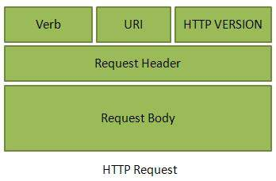
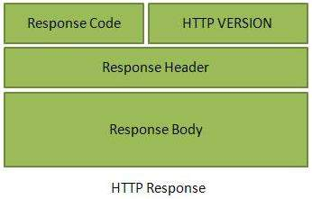

  
#Restful web services with JAX-RS
##Day 1: Restful webservices with JAX-RS
###Studymaterial:
[Simple introduction](https://jersey.java.net/documentation/latest/jaxrs-resources.html#d0e2822)  
[Tutorials point on ReST](https://www.tutorialspoint.com/restful/index.htm)   
**Read the 10 points under headline: RESTful Tutorial** (You can skip 3 and 4 about env and first application)  
[Tutorial on how to manually test rest api with postman app](https://blog.matrix42.com/2016/08/08/api-testing-postman-part-1/)  
[Nice list of simple examples using Jax-RS](http://www.mkyong.com/tutorials/jax-rs-tutorials/)

###Definition of web service
"*a method of communication between two electronic devices over a network. 
It is a software function provided at a network address over the web, with the service always on.*"

###Restful webservice
- HTTP transport protocol
- No specific Data Protocol

###Alternatives to Restful webservices
- SOAP
	- Simple Object Access Protocol
	- [Read more here](https://en.wikipedia.org/wiki/SOAP)
- WSDL
	- Web Service Description Language
	- [Read more here](http://www.w3schools.com/xml/xml_wsdl.asp)

###REST - REpresentational State Transfer 
- Representational
    - Clients possess the information necessary to identify, modify, and/or delete a web resource.
- State
    - All resource state information is stored on the client.
- Transfer
    - Client state is passed from the client to the service through HTTP.

### Demo
  
- Start new maven project
- import the relevant dependencies to POM.xml
	- [Here is an example](https://dzone.com/articles/build-rest-service-netbeans-7)
- Create a 'New Restful webservice from pattern'
- Change the path to: api/myresponse
- Change the @Get method to just send a hello world message.
- Test it from the browser.
- Test it from Postman

###Postman
- Install
- Introduction to the tool

###Rest and HTTP methods
- GET - Provides a read only access to a resource.
- PUT - Used to create a new resource.
- DELETE - Used to remove a resource.
- POST - Used to update a existing resource or create a new resource.

### Webressources in REST
- Refers to anything you can get from the server
- Most likely in the form of
	- text
	- XML or
	- JSON (What we will use)
- Web ressource is
	- An object in OOP
	- An entity in DB
- **IMPORTANT**: Rest has **no FORMAT restriction**
	- Means that we have to make it intuitive ourselfes (and/or write an API documentation)

### HTTP messaging

##### HTTP REQUEST
  

- Verb
	- Indicate HTTP methods such as GET, POST, DELETE, PUT etc.
- URI
	- Uniform Resource Identifier (URI) to identify the resource on server
- HTTP Version
	- Indicate HTTP version, for example HTTP v1.1 .
- Request Header
	- Contains metadata for the HTTP Request message as key-value pairs. For example, client ( or browser) type, format supported by client, format of message body, cache settings etc.
- Request Body
	- Message content or Resource representation.

#####HTTP RESPONSE
  

- Status/Response Code
	- Indicate Server status for the requested resource. For example 404 means resource not found and 200 means response is ok.
- HTTP Version
	- Indicate HTTP version, for example HTTP v1.1 .
- Response Header
	- Contains metadata for the HTTP Response message as key-value pairs. For example, content length, content type, response date, server type etc.
- Response Body
	- Response message content or Resource representation.

###Lets demo
  
- use chrome to access: `http://46.101.253.187:8080/quotes/api/quote/1`
- check network tab in chrome developer tools to see the HTTP messages

##Exercise day1:
[Click here for the daily exercise](https://github.com/CphBusCosSem3/Exercises/blob/master/SP/SP5/REST_JAX-RS_ex1.pdf)
